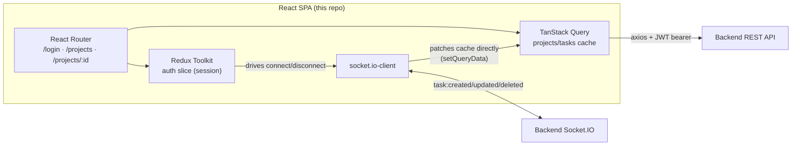

# Project Management Frontend

React + TypeScript SPA for an internal project/task management tool — kanban-style task boards with real-time updates. Built with Vite, Redux Toolkit, TanStack Query, and Socket.IO.

Companion repo: [projectManagementBackend](https://github.com/lionelraykai/projectManagementBackend) (Node/Express/MongoDB/Socket.IO API).

## 1. Architecture Overview



- **Routing**: `LoginPage` (public-only), `ProjectListPage` and `TaskBoardPage` (protected, wrapped in `Layout`) — see [`src/App.tsx`](src/App.tsx).
- **Two state systems, deliberately split**: session/auth (`accessToken`, `refreshToken`, `user`) is genuine client state with explicit transitions → a Redux Toolkit slice ([`authSlice.ts`](src/features/auth/authSlice.ts)). Projects/tasks are server-owned data the client caches and now also patches live from sockets → TanStack Query, using `queryClient.setQueryData` as the write path for socket events instead of refetching (see [`useProjectSocket.ts`](src/hooks/useProjectSocket.ts)).
- **Socket lifecycle lives in the store**, not a component effect ([`app/store.ts`](src/app/store.ts)): `store.subscribe` connects the socket the instant a session exists (including one restored from `localStorage` on page load) and disconnects it the instant the session clears. This sidesteps a real ordering bug — child-component effects can fire before a parent's, so a page that mounts straight into `/projects/:id` (a refresh or deep link) could otherwise try to join a socket room before the socket had connected.
- **Consistent state on load**: opening a project always fetches the current task list via REST first (TanStack Query's initial fetch); the socket room join happens after, purely for subsequent live updates. A late-joining viewer never depends on replaying past socket events.

## 2. Design Decisions & Trade-offs

- **Redux Toolkit for auth, TanStack Query for everything server-owned** — rejected putting both in one store. Auth has real state transitions (login/logout/refresh) that fit reducer semantics; projects/tasks are a cache with loading/error states and live invalidation that TanStack Query already models, so building that by hand in Redux would just be reimplementing it. Plain React Context was ruled out for the task data specifically: a Context provider re-renders every consumer on any value change, which gets expensive once updates arrive at socket frequency (every task move from any user, not just the local one).
- **Single in-flight token refresh** ([`api/client.ts`](src/api/client.ts)): the axios response interceptor shares one `refreshPromise` across concurrent 401s, so a burst of requests that all expire at once triggers exactly one `/auth/refresh` call, not N. `/auth/*` requests are excluded from the retry-on-401 path to avoid a refresh loop against the refresh endpoint itself.
- **Manual `localStorage` persistence instead of `redux-persist`**: the auth slice is one small object (`user`, `accessToken`, `refreshToken`); a `store.subscribe` callback writing/clearing one key was less machinery than a persistence library for this shape of state.
- **Socket auth sends a function, not a static token** ([`socket/socket.ts`](src/socket/socket.ts)): `socket.io-client`'s `auth` option accepts `(cb) => cb({ token })`, called on every (re)connection attempt — so a reconnect after the 15-minute access-token expiry, or after a server restart, always sends the *current* token from the store rather than the one captured at first connect.
- **Rejoin project room on every `connect` event**, not just on mount ([`useProjectSocket.ts`](src/hooks/useProjectSocket.ts)): a dropped connection loses server-side Socket.IO room membership even though the client auto-reconnects the socket itself, so the hook re-emits `join:project` on every `connect`, not only when the component first mounts.
- **REST is the only write path from the client** — task moves/edits are always a `PATCH`/`DELETE` HTTP call; sockets are consumed read-only (`task:created/updated/deleted`) and never emitted as a way to mutate data. This mirrors the backend's design and means there's exactly one client code path to test per mutation.

## 3. API List

Endpoints this app calls (full server-side contract, incl. auth requirements, is documented in the [backend README](https://github.com/lionelraykai/projectManagementBackend#3-api-list)):

| Module | Calls |
|---|---|
| [`api/auth.api.ts`](src/api/auth.api.ts) | `POST /auth/register`, `POST /auth/login`, `POST /auth/logout` |
| [`api/users.api.ts`](src/api/users.api.ts) | `GET /users/me`, `GET /users` |
| [`api/projects.api.ts`](src/api/projects.api.ts) | `GET /projects`, `POST /projects`, `GET /projects/:id`, `POST /projects/:id/members`, `DELETE /projects/:id/members/:userId` |
| [`api/tasks.api.ts`](src/api/tasks.api.ts) | `GET /projects/:id/tasks`, `POST /projects/:id/tasks`, `PATCH /tasks/:taskId` (status or assignee), `DELETE /tasks/:taskId` |

Token refresh (`POST /auth/refresh`) is called automatically by the axios interceptor on a 401, not from a page/component.

## 4. Socket Events List

| Direction | Event | When | Handled in |
|---|---|---|---|
| client → server | `join:project` `{ projectId }` | On mounting a project board, and on every socket `connect` (incl. reconnects) | [`socket/socket.ts`](src/socket/socket.ts), [`hooks/useProjectSocket.ts`](src/hooks/useProjectSocket.ts) |
| client → server | `leave:project` `{ projectId }` | On unmounting the project board | same |
| server → client | `task:created` | New task added by anyone viewing the project | upserts into the TanStack Query cache for that project's task list |
| server → client | `task:updated` | Task edited/moved by anyone | same upsert path |
| server → client | `task:deleted` | Task removed by anyone | removes it from the cached list |

Connection is established once per session by the Redux store (`app/store.ts`), not per-page — see Architecture Overview above.

## 5. Local Setup

Prerequisites: Node.js 18+, the backend running (locally or pointed at a deployed instance).

```bash
git clone https://github.com/lionelraykai/projectManagementFrontend.git
cd projectManagementFrontend
npm install
cp .env.example .env   # defaults already point at a local backend on :4000
npm run dev             # Vite dev server, http://localhost:5173
```

| Env var | Purpose | Local default |
|---|---|---|
| `VITE_API_URL` | Backend REST base URL | `http://localhost:4000/api` |
| `VITE_SOCKET_URL` | Backend Socket.IO URL | `http://localhost:4000` |

The backend's `CORS_ORIGIN` must match wherever this app runs (`http://localhost:5173` by default in the backend's own `.env.example`).

## 6. Deployment Steps (Render — Static Site)

This app is a static SPA (Vite build output, no server-side code) — deploy it as a Render **Static Site**, not a Web Service. (A Web Service running `npm run dev` binds Vite's dev server to `localhost` only, which Render's port scanner never detects — that was the original misconfiguration for this project.)

1. In Render: **New → Static Site**, connect `lionelraykai/projectManagementFrontend`.
2. **Build Command:** `npm install && npm run build`
3. **Publish Directory:** `dist`
4. Environment variables (Settings → Environment, available at build time since Vite inlines `VITE_*` vars): `VITE_API_URL` = `<deployed backend URL>/api`, `VITE_SOCKET_URL` = `<deployed backend URL>`.
5. **Add a rewrite rule** (Redirects/Rewrites tab): source `/*` → destination `/index.html`, type **Rewrite**. Required because this is a client-side-routed SPA (React Router) — without it, refreshing or deep-linking to `/projects/:id` 404s at the CDN edge instead of reaching `index.html`.
6. Deploy, then confirm the backend's `CORS_ORIGIN` env var is set to this static site's URL (see backend README §6) — otherwise API calls and the Socket.IO handshake will fail from the browser.

## 7. URLs

| | |
|---|---|
| Frontend repo | https://github.com/lionelraykai/projectManagementFrontend |
| Backend repo | https://github.com/lionelraykai/projectManagementBackend |
| Backend API this build points at (production) | https://projectmanagementbackend-msa6.onrender.com |
| Live frontend (Render) | *pending — configure as a Static Site per §6; the Web Service attempt does not expose a URL since it never binds a detected port* |

## 8. Reference Docs

- [`docs/FRD.md`](docs/FRD.md) — functional requirements, roles/permissions, scope and assumptions.
- [`docs/SYSTEM_DESIGN.md`](docs/SYSTEM_DESIGN.md) — original system design doc. Note: it describes Redis as the Socket.IO adapter and refresh-token store; the backend has since moved refresh-token storage to a TTL-indexed MongoDB collection (see the backend README §2), and this project currently runs as a single instance, so no cross-instance Socket.IO adapter is in play yet.
