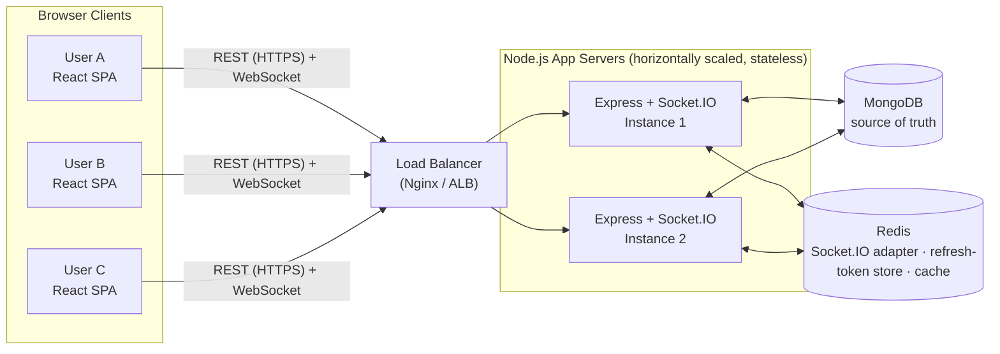

# System Design
## Internal Project Management System — Real-Time Collaboration

### 1. High-Level Architecture



**Example flow (User A moves a task, User B is live, User C opens later):**
1. User A's client sends `PATCH /api/tasks/:id` (status change) to whichever app instance the load balancer routes it to.
2. That instance validates the request and writes the change to MongoDB (source of truth).
3. On a successful write, the instance emits `task:updated` to the Socket.IO room `project:<projectId>`.
4. The Redis pub/sub adapter rebroadcasts that event to every app instance, so User B receives it live even if their socket is connected to a different instance than the one that handled the PATCH.
5. User C opens the project later: the client first calls `GET /api/projects/:id/tasks` (current DB state), renders it, *then* joins the `project:<projectId>` socket room for subsequent live updates. Late joiners never depend on socket message history.

### 2. API List

**Auth**
| Endpoint | Purpose |
|---|---|
| `POST /api/auth/register` | Create a user account |
| `POST /api/auth/login` | Authenticate, issue JWT access token + refresh token |
| `POST /api/auth/refresh` | Exchange a valid refresh token for a new access token |
| `POST /api/auth/logout` | Revoke the refresh token (removed from Redis) |

**Users**
| Endpoint | Purpose |
|---|---|
| `GET /api/users/me` | Current user's profile |
| `GET /api/users` | List org users (admin only; used to populate assignee pickers) |

**Projects**
| Endpoint | Purpose |
|---|---|
| `GET /api/projects` | List projects the current user is a member of |
| `POST /api/projects` | Create a project (creator becomes Owner) |
| `GET /api/projects/:id` | Project details + member list |
| `PATCH /api/projects/:id` | Update project (Owner/Admin) |
| `DELETE /api/projects/:id` | Archive/delete project (Owner/Admin) |
| `POST /api/projects/:id/members` | Add a member with a role |
| `DELETE /api/projects/:id/members/:userId` | Remove a member |

**Tasks**
| Endpoint | Purpose |
|---|---|
| `GET /api/projects/:id/tasks` | List tasks for a project (current-state snapshot; supports pagination/status filter) |
| `POST /api/projects/:id/tasks` | Create a task |
| `PATCH /api/tasks/:taskId` | Update a task (status/assignee/fields) → triggers real-time broadcast |
| `DELETE /api/tasks/:taskId` | Delete a task → triggers real-time broadcast |

**Activity**
| Endpoint | Purpose |
|---|---|
| `GET /api/projects/:id/activity` | Recent change feed for the project |

**WebSocket events**
| Direction | Event | Purpose |
|---|---|---|
| client → server | `join:project` `{ projectId }` | Subscribe to a project's live updates |
| client → server | `leave:project` `{ projectId }` | Unsubscribe |
| server → client | `task:created` / `task:updated` / `task:deleted` | Push the changed task entity |
| server → client | `member:updated` | Push project membership changes |

### 3. Database Schema (MongoDB)

```
users
  _id, name, email (unique, indexed), passwordHash, role: 'admin' | 'user', createdAt

projects
  _id, name, description, ownerId (ref users), archived: bool, createdAt, updatedAt

projectMembers
  _id, projectId (ref, indexed), userId (ref, indexed), role: 'owner' | 'member' | 'viewer', joinedAt
  -- unique compound index on (projectId, userId)

tasks
  _id, projectId (ref, indexed), title, description,
  status: 'todo' | 'in_progress' | 'done',
  assigneeId (ref users, nullable), priority: 'low' | 'medium' | 'high',
  dueDate, createdBy, createdAt, updatedAt
  -- compound index on (projectId, status)

activityLog (optional, TTL-indexed)
  _id, projectId (indexed), userId, action, entityType, entityId, meta, createdAt
```

Refresh tokens are **not** stored in MongoDB — they live in Redis keyed by user/token id with a TTL matching token expiry, so logout/revocation is an O(1) delete with no DB write.

**Indexes:** `users.email` (unique), `projectMembers.(projectId, userId)` (unique compound), `tasks.(projectId, status)`, `tasks.assigneeId`, `projects.ownerId`.

### 4. Real-Time Communication Strategy

- **Socket.IO** over raw WebSocket: automatic reconnection, room abstraction, and transport fallback (long-polling) with straightforward Express integration.
- **Rooms per project** (`project:<projectId>`) — clients join on opening a project, leave on navigating away.
- **REST is the only write path**, not raw socket emits: validation, auth, and persistence stay in one auditable, retriable place. The socket layer is push-only, fired *after* a successful DB write.
- **Redis's job here is specifically cross-instance fan-out** — Socket.IO's default in-memory adapter only broadcasts within a single Node process; the Redis adapter republishes events so all instances (and their connected clients) stay in sync.
- Late joiners never replay socket history — they always start from a REST `GET` snapshot, which sidesteps needing an event-sourcing/replay system for v1.

### 5. Why This Approach
- REST-for-writes + Socket.IO-for-fan-out keeps a single write path (easy to validate, cache, and audit) while still getting instant propagation — without needing event sourcing or replay logic just to handle late joiners.
- **MongoDB** fits the document-shaped, lightly-relational data (`project → tasks`) and needs no migrations as task fields evolve.
- **Redis** does two well-understood jobs (Socket.IO adapter, refresh-token store) rather than being introduced as a novel, single-purpose dependency.
- **Redux Toolkit + TanStack Query** for frontend state (vs. plain Context): the app has two distinct kinds of state that don't belong in one store. Auth/session (current user, tokens, UI state) is genuine client state with explicit transitions (login, logout, refresh) — a good fit for a Redux Toolkit slice with normal action/reducer semantics. Projects and tasks are server state — data owned by the API that the client caches, invalidates, and now also patches live from socket events — which is exactly what TanStack Query is built for (per-query cache, loading/error states, and `queryClient.setQueryData` as the write path for socket-pushed updates, avoiding a refetch on every event). Splitting them this way avoids Redux boilerplate for data that's really just a cache, and avoids TanStack Query being misused for state it doesn't own (auth tokens). Plain Context was ruled out for the same reason called out in the original Zustand comparison: it re-renders every consumer on any Provider value change, which is costly once task updates arrive at socket frequency.

### 6. Scalability Considerations
- App servers are **stateless** (JWT auth, no in-memory session) → scale horizontally behind the load balancer.
- The Redis Socket.IO adapter removes the *hard* requirement for sticky sessions (any instance can broadcast to any client via Redis), though sticky sessions are still recommended to reduce reconnect churn.
- MongoDB: compound index on `(projectId, status)` covers the hot task-list query; move to a replica set for availability (recommended even at v1), and shard by `projectId` if a single deployment grows very large.
- Redis: a single instance is sufficient at this scale; move to Redis Cluster/Sentinel if pub/sub or token-store load grows.
- Pagination and status filtering on `GET /tasks` prevent unbounded payloads as a project's task count grows.
- Redis-backed rate limiting on auth and write endpoints to protect against abuse.
- Horizontal scaling of Node instances is the primary scaling lever for both REST and WebSocket traffic, with Redis as the shared coordination layer between them.
